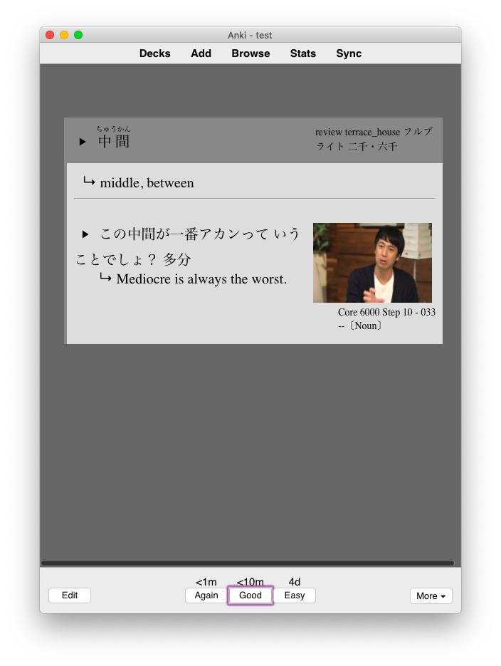
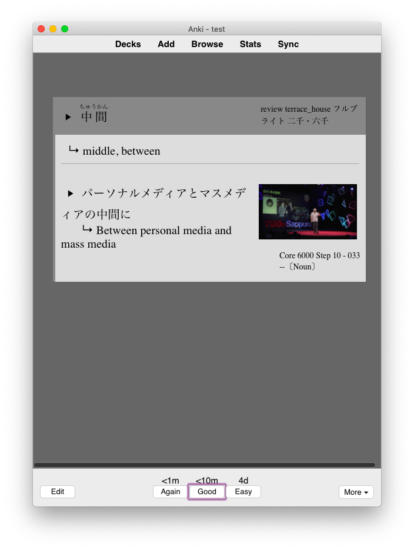
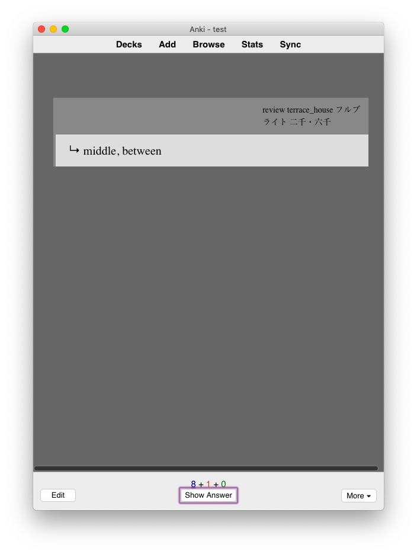
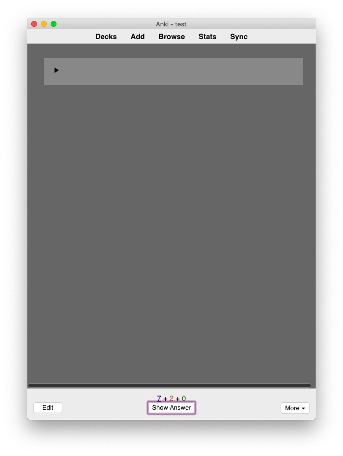
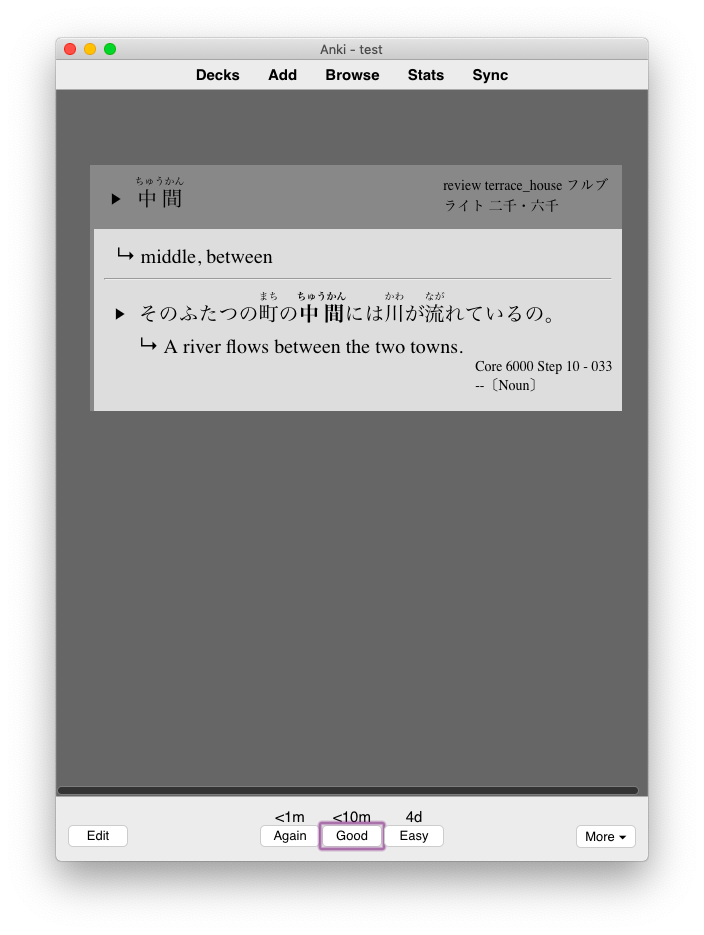
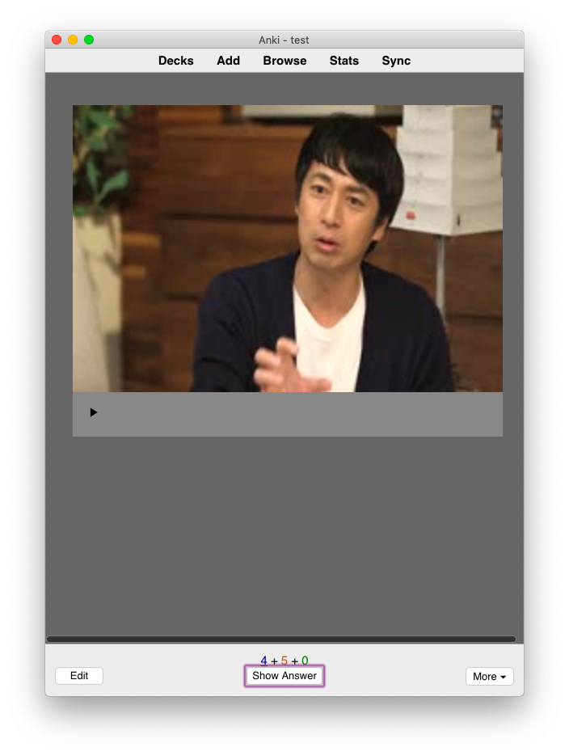
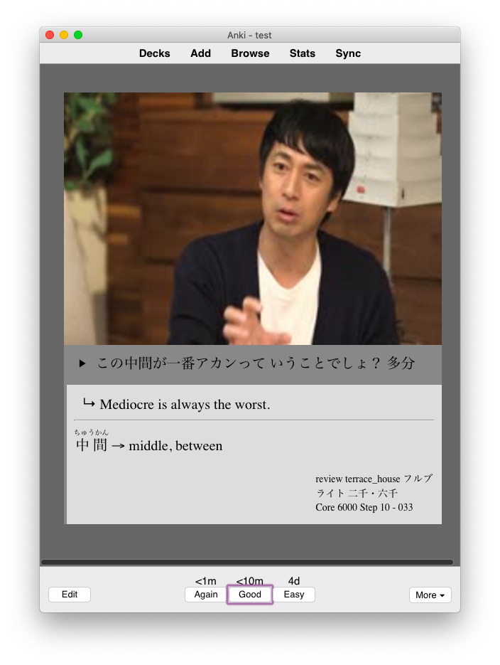
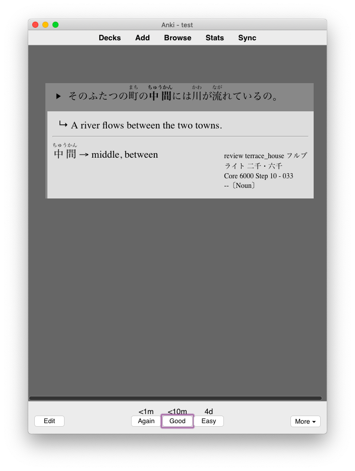
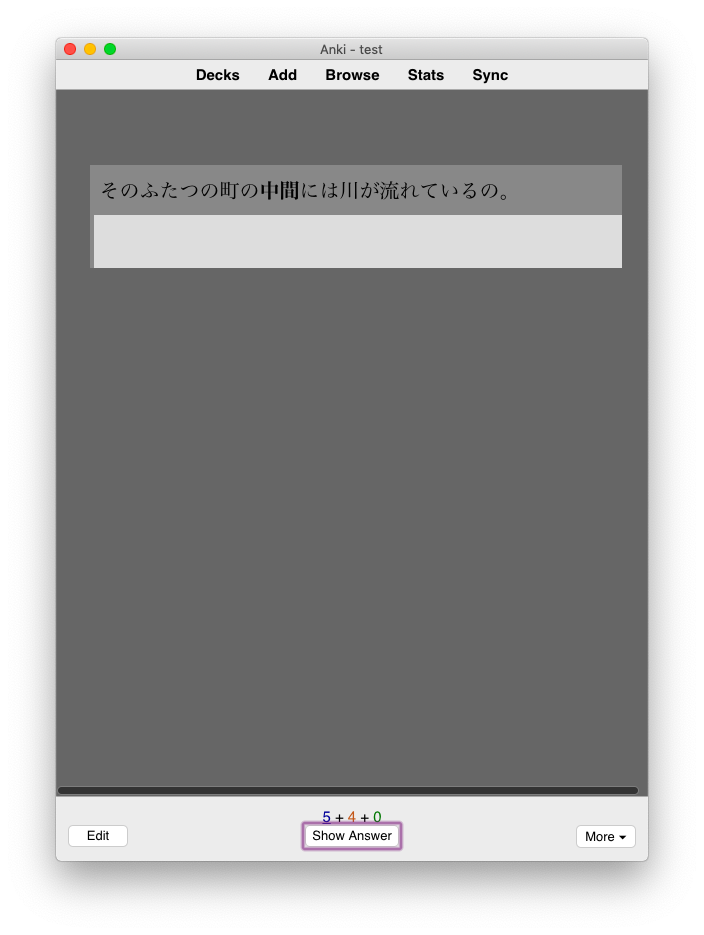
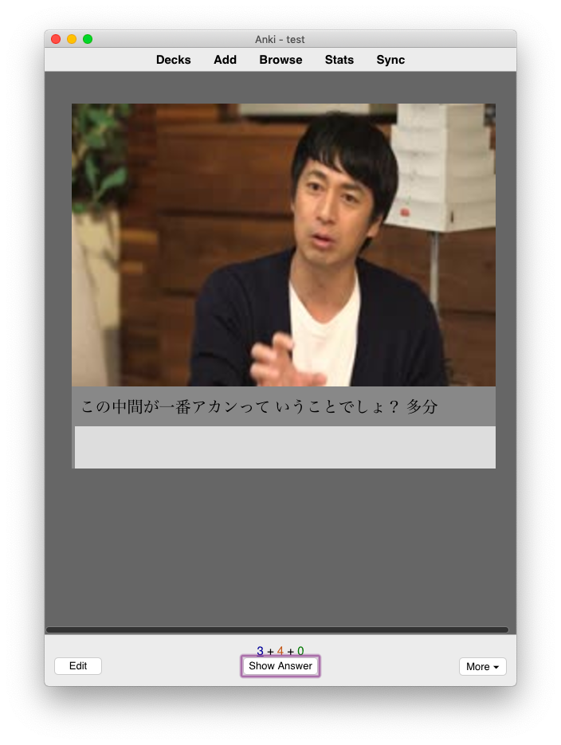

# Adaptive Vobabulary Flashcards for Anki 2.0+

A useful vocabulary flashcard template for Anki that creates cards for variety of study methods from one note.

_Note: because I've been using Anki to study Japanese from English, all examples on this page will reference either Japanese or English. For your own use, however, there's nothing in this template that won't work simply because you aren't learning Japanese (so far as I know). It simply has some extra features for Japanese use._

## Cards created

1. Japanese --> English
2. English --> Japanese
3. Listening
4. Listening (Sentence)
5. Sentence
6. Listening (Sentence 2)
7. Sentence 2
8. Listening (Sentence 3)
9. Sentence 3

### 1. Japanese --> English

Front:

The front of this card displays the vocab word in Japanese, as well as any tags you have on the card. The card above, for example, has the vocab word 中間. Many of the tags I use here are sources for the information on the card.

Back:

The back of the card adds furigana for the Japanese vocab word, as well as audio and an English translation. Below this is an example sentence, along with (optional) audio, English translation, and reference picture (for example, something you might find on a subs2srs card). Finally, any notes or part of speech information you have is displayed at the very bottom.

Most interestingly though (and most useful), if you have multiple sentences saved to your associated note (in this version, up to 3 sentences, though with a little bit of Anki knowledge it's very easy to add more), this template will choose to display one of your sentences at random. So, while your J --> E card might display the back picture above one review, the next time it might display this:

Everything's the same except the sentence.

_Note: because of how Anki processes audio on cards, if you have multiple audio files associated with your sentences on a note, you_ must _turn autoplay off on your cards, otherwise Anki will play every audio file for every sentence in order. As far as I know, this cannot be fixed, but if anyone knows how, please let me know._

### 2. English --> Japanese

Front:

Pretty straightforwardly, this card shows an English word and asks you to guess the Japanese translation. As before, the back will display a randomly chosen sentence. In fact, the back will be exactly the same:

Back:

### 3. Listening

Front:

For this card, you need to listen to a recording of a Japanese vocab word then both recognize the word and its meaning. Thus, the card is pretty simple: just an audio button.

_Note: if you'd like this card to autoplay but have the autoplay issue described above, you can move all your listening cards to a separate deck and set that deck to automatically play audio. This is not an elegant solution, it hardly needs to be said, but it's what I've managed to make work_

Back:

This back should be pretty familiar now--all the information from before--but there is one wrinkle. Because of how Anki handles audio, as well as the need for listening cards to autoplay, the back of the card will only ever display the first sentence associated with the card's note. Imperfect? Yes. But it's functional.

### 4. Listening (Sentence)

Front:

Pretty familiar, right? This card works exactly the same as the basic listening card, except it asks you to recognize the audio of a full sentence rather than a single word. So, it looks the same.

If, though, you have an image associated with the sentence you're listening to, the card will look like this:

Front:

The image will show up large and in focus, which looks very nice when you turn the card over to the back:

Back:

It looks almost like a TV show with subtitles and translations underneath, with some extra information below that. I have the cards set up to display the associated Japanese vocab word and English definition, as well as tags and notes, but like all things Anki, you can change this.

If you don't have an image, the back of the card looks like this:

### 5. Sentence

The final major kind of card. This one asks you to read a sentence, then displays the translation on the back.

Front:

It displays the sentence, nothing more.

Back:

This back is exactly the same as the listening back: A translation, definition, tags.

If you have an image on your card, it will display big too, like so:

Front:

Back:

Notice again how similar so many of these cards are: the goal is to make everything look almost identical, so that the focus of the cards is the vocabulary or sentence being studied, not the cards themselves. You are simply studying one small part of each note.

### The rest of the cards

From here on out, all the cards are just versions of cards 4 and 5, but with new sentences. If you like to have a lot of practice sentences for each Japanese vocab word you're learning (like me), this is very useful. You can throw in as many practice sentences as you'd like, and you'll always have a record of what word you're trying to learn through it.
