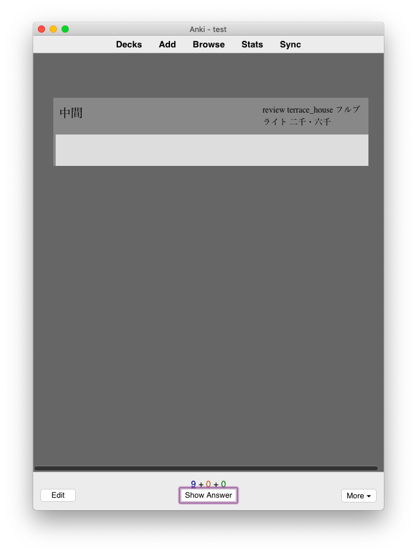

# Adaptive Vobabulary Flashcards for Anki 2.0+

A useful vocabulary flashcard template for Anki that creates cards for variety of study methods from one note.

_Note: because I've been using Anki to study Japanese from English, all examples on this page will reference either Japanese or English. For your own use, however, there's nothing in this template that won't work simply because you aren't learning Japanese (so far as I know). It simply has some extra features for Japanese use._

## Cards created

1. Japanese --> English
2. English --> Japanese
3. Listening
4. Listening (Sentence)
5. Sentence
6. Listening (Sentence 2)
7. Sentence 2
8. Listening (Sentence 3)
9. Sentence 3

### 1. Japanese --> English

Front:

The front of this card displays the vocab word in Japanese, as well as any tags you have on the card. The card above, for example, has the vocab word 中間. Many of the tags I use here are sources for the information on the card.

Back:

The back of the card adds furigana for the Japanese vocab word, as well as audio and an English translation. Below this is an example sentence, along with (optional) audio, English translation, and reference picture (for example, something you might find on a subs2srs card). Finally, any notes or part of speech information you have is displayed at the very bottom.

Most interestingly though (and most useful), if you have multiple sentences saved to your associated note (in this version, up to 3 sentences, though with a little bit of Anki knowledge it's very easy to add more), this template will choose to display one of your sentences at random. So, while your J --> E card might display the back picture above one review, the next time it might display this:

Everything's the same except the sentence.

_Note: because of how Anki processes audio on cards, if you have multiple audio files associated with your sentences on a note, you_ must _turn autoplay off on your cards, otherwise Anki will play every audio file for every sentence in order. As far as I know, this cannot be fixed, but if anyone knows how, please let me know._
